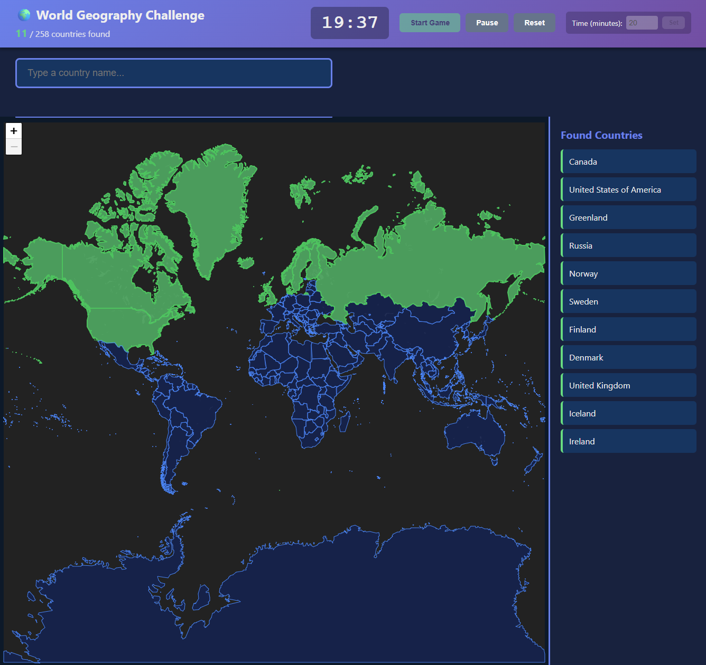

# 🌍 World Map Geography Game

An interactive geography game built with Deno, TypeScript, and Leaflet.js where players race against time to identify countries around the world!

## Screenshot



## Features

- 🗺️ **Interactive World Map** - Full-screen Leaflet.js map with country boundaries
- ⏱️ **Customizable Timer** - Default 20 minutes, adjustable from 1-120 minutes
- 🔍 **Smart Search** - Instant recognition with country name aliases (e.g., "USA", "UK")
- ✨ **Visual Feedback** - Countries highlight in green and pan into view when found
- 📊 **Progress Tracking** - Real-time counter and filterable sidebar list of found countries
- 🎮 **Game Controls** - Start, pause, and reset functionality
- 🏆 **End Game Stats** - Final score, percentage completion, and list of missed countries
- 🌐 **Curated Country List** - Focuses on major countries (excludes micro-states for better gameplay)

## Prerequisites

- [Deno](https://deno.land/) installed on your system (v2.0 or higher recommended)

## Installation

1. Clone or download this repository
2. Navigate to the project directory:
   ```bash
   cd map-game
   ```

## Running the Game

Start the server with Deno:

```bash
deno task start
```

Or use the full command:

```bash
deno run --allow-net --allow-read server.ts
```

The game will be available at: **http://localhost:8000/**

## How to Play

1. **Set Your Timer** (Optional)
   - Default is 20 minutes
   - Enter a custom time (1-120 minutes) and click "Set"

2. **Start the Game**
   - Click the "Start Game" button
   - The timer begins counting down
   - The search bar becomes active

3. **Find Countries**
   - Type country names in the search bar
   - Countries are recognized instantly as you type
   - Use common aliases (e.g., "USA" for United States, "UK" for United Kingdom)
   - Correct countries will highlight in green and pan into view
   - Input clears automatically after each correct answer

4. **Track Progress**
   - View your score at the top (e.g., "45/165 countries found")
   - See all found countries listed in the right sidebar
   - Use the filter box to search through found countries
   - Timer changes color as time runs low (yellow at 5 min, red at 1 min)

5. **Game Controls**
   - **Pause**: Pause the timer and disable search
   - **Reset**: Start over with a fresh game

6. **Game End**
   - Game ends when timer reaches zero or all countries are found
   - View your final statistics and list of missed countries
   - Click "Play Again" to restart

## Project Structure

```
map-game/
├── deno.json           # Deno configuration and tasks
├── deno.lock           # Dependency lock file
├── server.ts           # Deno HTTP server with TypeScript transpilation
├── README.md           # This file
├── images/
│   └── screenshot.png  # Game screenshot
└── public/
    ├── index.html      # Main game page
    ├── styles.css      # Game styling
    ├── game.ts         # Game logic (TypeScript)
    └── data/           # (Reserved for local data files)
```

## Technologies Used

- **Deno** - Modern JavaScript/TypeScript runtime
- **TypeScript** - Type-safe game logic
- **esbuild** - Fast TypeScript transpilation on-the-fly
- **Leaflet.js** - Interactive map library
- **GeoJSON** - Country boundary data from [datasets/geo-countries](https://github.com/datasets/geo-countries)
- **CARTO Dark Theme** - Map tile layer (no labels for cleaner gameplay)

## Tips for Players

- Start with larger, well-known countries you know well
- Use common aliases (USA, UK, Russia, etc.) for faster input
- Pay attention to regions - finding one country can help you remember nearby ones
- The map pans to each found country, helping you learn geography
- Use the filter box in the sidebar to review which countries you've found
- Try different time limits to challenge yourself
- The game excludes micro-states and city-states for a more focused experience

## Customization

### Change Default Timer
Edit `game.ts` line 90:
```typescript
timeRemaining: 1200, // Change this value (in seconds)
```

### Change Map Theme
Edit `game.ts` lines 143-149 to use a different tile layer:
```typescript
L.tileLayer('YOUR_TILE_LAYER_URL', {
    // Your configuration
}).addTo(mainState.map);
```

### Adjust Map Starting Position
Edit `game.ts` line 140:
```typescript
.setView([20, 0], 3); // [latitude, longitude], zoom level
```

### Modify Excluded Countries
Edit `game.ts` lines 160-191 to add or remove countries from the excluded list:
```typescript
const excludedCountries = [
    'vatican city',
    'monaco',
    // Add or remove countries here
];
```

### Add Country Aliases
Edit `game.ts` lines 54-80 to add custom country name aliases:
```typescript
const countryAliases: CountryAliases = {
    'usa': 'united states of america',
    'uk': 'united kingdom',
    // Add more aliases here
};
```

## Troubleshooting

**Map not loading?**
- Check your internet connection (map tiles load from external source)
- Ensure port 8000 is not in use by another application

**Countries not appearing?**
- The GeoJSON data loads from GitHub - ensure you have internet access
- Check browser console for any error messages

**Timer not working?**
- Ensure JavaScript is enabled in your browser
- Try refreshing the page

**TypeScript errors?**
- The server automatically transpiles TypeScript to JavaScript
- Check the server console for any transpilation errors

## License

This project is open source and available for educational purposes.

## Credits

- Country boundary data: [datasets/geo-countries](https://github.com/datasets/geo-countries)
- Map tiles: [CARTO](https://carto.com/)
- Map library: [Leaflet.js](https://leafletjs.com/)

---

Enjoy learning world geography! 🌎🌍🌏